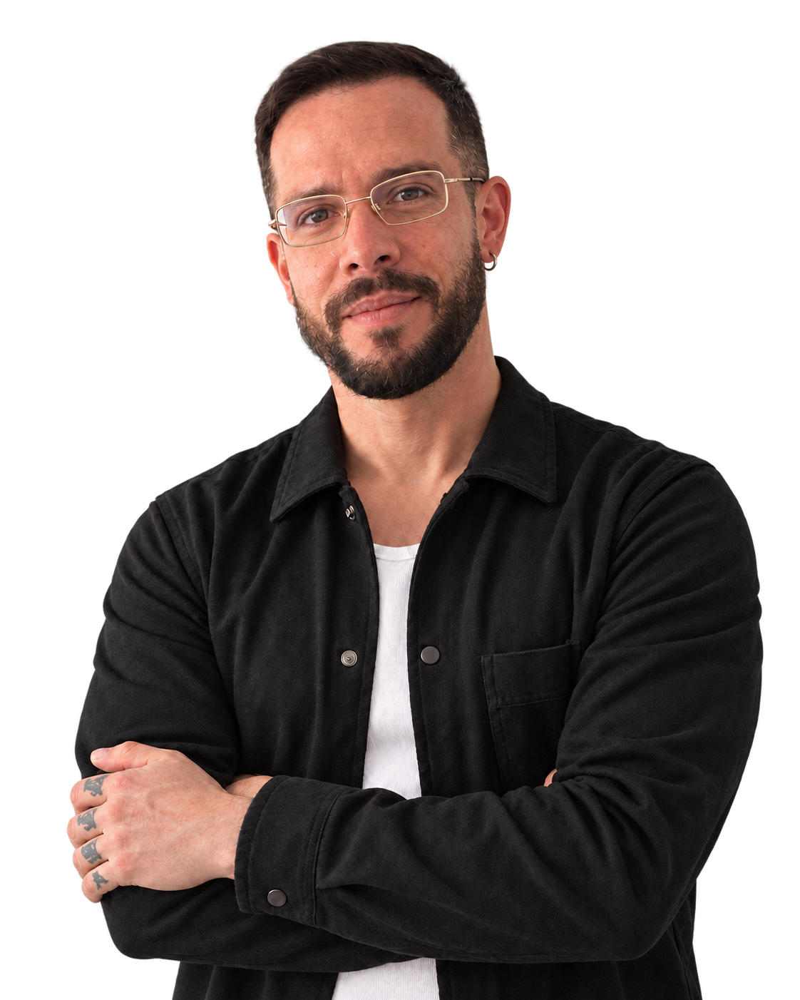

# Diego Franco — AI Solutions Engineer

**Ideas into systems.**

Portfolio profesional de Diego Franco: full-stack product development, AI copilots, RAG, workflow automation, integrations and product UX/UI.

**Live portfolio:** https://www.diegofrancoe.com/

## Featured work

1. **CENIZA — AI-Powered Full-Stack CRM**  
   CRM comercial y operativo con Supabase, datos estructurados, automatización y un asistente de IA contextual basado en RAG híbrido.  
   [Live demo](https://ceniza-crm.vercel.app/) · [Case study](https://www.diegofrancoe.com/proyectos/ceniza)

2. **NAVAL — AI Business Ecosystem**  
   Plataforma B2B con catálogo, asistente comercial y automatización. El ERP operativo continúa en desarrollo privado.  
   [Live website](https://www.productosnaval.com/) · [Case study](https://www.diegofrancoe.com/proyectos/naval)

3. **40+ — E-commerce & Automation**  
   Experiencia de comercio, venta asistida por WhatsApp y automatización segura de comunicaciones y datos.  
   [Live website](https://cuarentamas.com/) · [Case study](https://www.diegofrancoe.com/proyectos/40-plus)

## Stack

React · TypeScript · JavaScript · CSS · Supabase · PostgreSQL · OpenAI · n8n · Make · Vercel · Figma

## Local development

~~~bash
npm install
npm run dev
~~~

## Production

~~~bash
npm run build
npm run preview
~~~

The project is deployed on Vercel from the repository root and preserves direct routes for profile, contact and project case studies.
