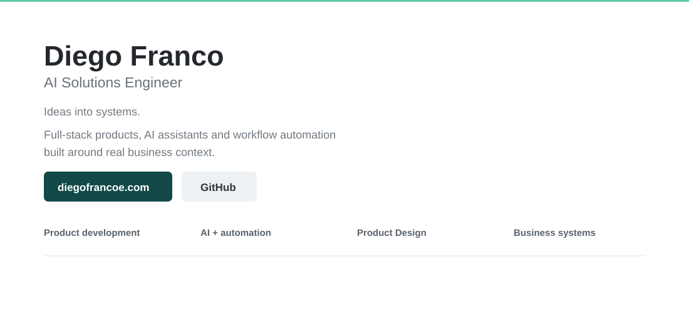

### Featured work

| Project | What I built | Access |
|---|---|---|
| **CENIZA** | Full-stack CRM + contextual AI agent | [Live demo](https://ceniza-crm.vercel.app/) · [Case study](https://www.diegofrancoe.com/proyectos/ceniza) |
| **NAVAL** | B2B platform + assistant + private ERP ecosystem | [Website](https://www.productosnaval.com/) · [Case study](https://www.diegofrancoe.com/proyectos/naval) |
| **40+** | E-commerce + WhatsApp sales + customer automation | [Website](https://cuarentamas.com/) · [Case study](https://www.diegofrancoe.com/proyectos/40-plus) |

### Core stack
      

<strong>Run locally</strong>

~~~bash
npm install
npm run dev
~~~

<strong>Production:</strong> https://www.diegofrancoe.com/

